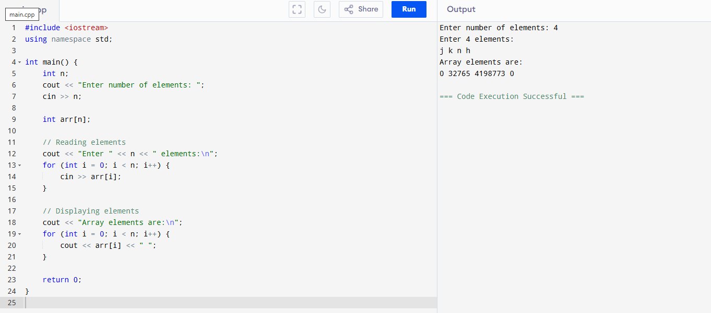
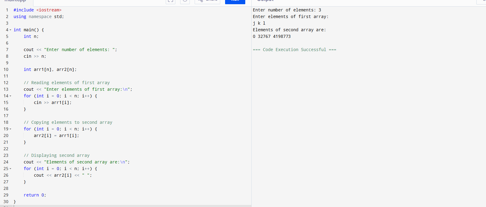
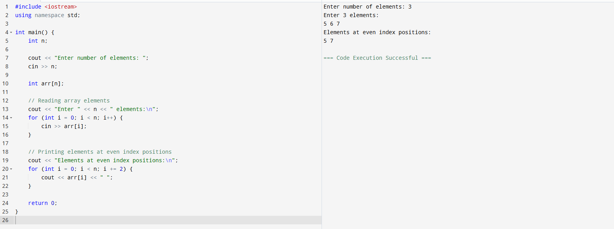
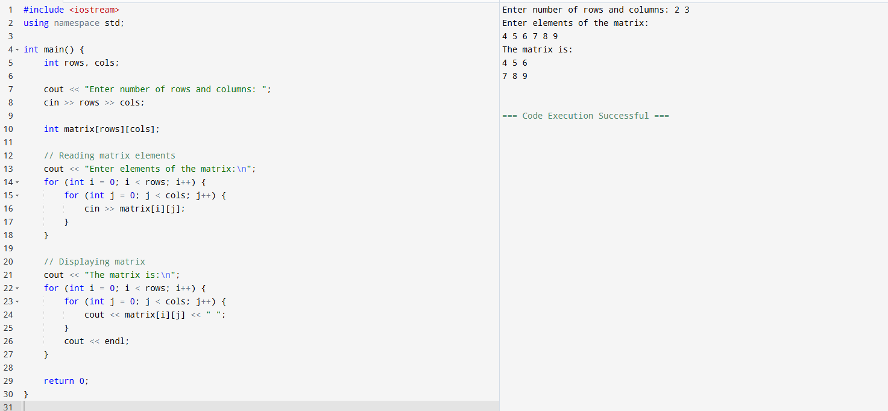
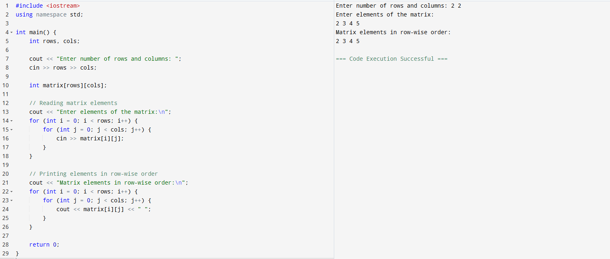
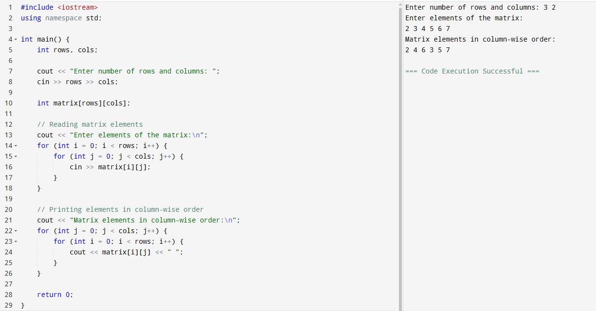

# programs-C-
# Write a C++ program to read and display elements of an array.

# Write a C++ program to find the sum of all elements in an array.

# Write a C++ program to copy one array into another.

# Write a C++ program to print array elements at even index positions.

# Write a C++ program to read and display a 2D array (matrix).

# Write a C++ program to print all elements of a matrix in row-wise order.

# Write a C++ program to print all elements of a matrix in column-wise order.
